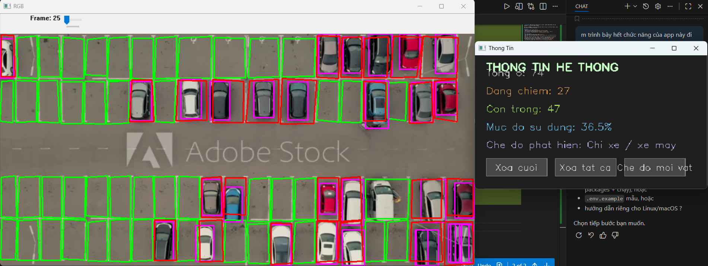
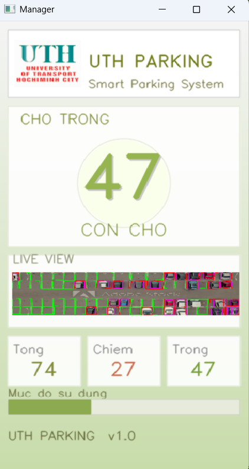

# ỨNG DỤNG NHẬN DIỆN CHỖ TRỐNG BÃI GIỮ XE — APP UTH

. **Ứng dụng**: Nhận diện chỗ trống bãi giữ xe (video / camera) bằng YOLOv8, hiển thị dashboard và gửi phản hồi email tự động.

Mục đích của README này: mô tả chức năng chính, cấu trúc file, cách tạo môi trường và lệnh chạy nhanh trên Windows (PowerShell).

**Yêu cầu**

- Python 3.8+ (khuyến nghị 3.10/3.11)
- GPU (tùy chọn) nếu muốn tăng tốc inference; CPU vẫn chạy được
- Các file quan trọng trong repository: `main.py`, `polygons.json`, `best.pt`, `email_config.py`, `email_service.py`, `runtime_status.py`, `gui.py`

**Chức năng chính**

- Phát hiện phương tiện bằng YOLOv8 (model `best.pt`).
- Định nghĩa vùng chỗ đỗ bằng polygon lưu trong `polygons.json` (vẽ 4 điểm trên cửa sổ `RGB`).
- Phân loại trạng thái từng chỗ: "trong" / "da chiem" với lọc thời gian để tránh nháy.
- Hiển thị 3 cửa sổ: `RGB` (video + bbox), `Thong Tin` (bảng thông tin), `Manager` (dashboard mobile-friendly). Nếu PySimpleGUI cài, thêm giao diện GUI hiện đại.
- Gửi/nhận email tự động theo trigger phrases (cấu hình trong `email_config.py`).
- Lưu trạng thái runtime trong `runtime_status.py` để chia sẻ giữa modules.

**Cấu trúc file chính**

- `main.py`: luồng chính, xử lý video, track, tính trạng thái, vẽ UI (OpenCV) và khởi GUI.
- `polygons.json`: vị trí chỗ đỗ (polygon list). Nếu không có, bạn có thể click 4 điểm trên cửa sổ `RGB` để thêm.
- `best.pt`: mô hình YOLO đã huấn luyện (bạn phải cung cấp).
- `gui.py`: giao diện PySimpleGUI (dashboard + compact window).
- `email_config.py` / `email_service.py`: cấu hình và xử lý email auto-responder.
- `runtime_status.py`: lưu trạng thái tổng/free/occupied + frame bytes.

**Tạo môi trường (PowerShell) — hướng dẫn từng bước**

1. Mở PowerShell và chuyển vào thư mục dự án (nếu chưa ở đó):

```
Set-Location F:\Chuyendegttm
```

2. Tạo virtual environment và kích hoạt:

```
py -3 -m venv .venv
.venv\Scripts\Activate.ps1
```

Nếu PowerShell báo lỗi execution policy khi activate, chạy 1 lần (với quyền user):

```
Set-ExecutionPolicy -ExecutionPolicy RemoteSigned -Scope CurrentUser
.venv\Scripts\Activate.ps1
```

3. Cài phụ thuộc cơ bản (CPU example):

```
pip install --upgrade pip
pip install -r requirements.txt
# cài torch CPU (nếu cần):
pip install "torch>=2.0.0" torchvision --index-url https://download.pytorch.org/whl/cpu
```

Ghi chú: nếu bạn có GPU NVIDIA, xem hướng dẫn chính thức tại https://pytorch.org để chọn lệnh cài tương ứng (CUDA version).

4. (Tuỳ chọn) Tạo file `.env` để lưu biến môi trường (không commit vào git):

```
notepad .env
# ví dụ nội dung:
GMAIL_USER=youremail@gmail.com
GMAIL_APP_PASSWORD=your_app_password
EMAIL_ENABLED=1
```

Và trong PowerShell có thể set tạm biến môi trường:

```
$env:GMAIL_USER = "youremail@gmail.com"
$env:GMAIL_APP_PASSWORD = "your_app_password"
$env:EMAIL_ENABLED = "1"
```

**Lệnh chạy**

- Chạy toàn bộ ứng dụng (mở video + dashboard):

```
py .\main.py
```

- Nếu `python` đã được thêm vào PATH bạn cũng có thể dùng:

```
python .\main.py
```

- Chỉ chạy compact GUI (nếu muốn test nhanh):

```
py -c "import gui, time; gui.start_compact(); time.sleep(600)"
```

**Phím tắt (trong cửa sổ OpenCV)**

- `SPACE`: Play / Pause
- `N`: Khung tiếp theo (khi paused)
- `O`: Đổi chế độ (tính mọi object là obstacle hoặc chỉ phương tiện)
- `R`: Xóa khu (polygon) cuối
- `C`: Xóa tất cả polygon
- `ESC` / `Q`: Thoát

**Cách thêm polygon (định nghĩa chỗ đỗ)**

- Mở cửa sổ `RGB` khi chương trình đang chạy và click 4 điểm lần lượt quanh chỗ đỗ (theo thứ tự). Khi click đủ 4 điểm, polygon được lưu vào `polygons.json`.

**Cấu hình email**

- Chỉnh `email_config.py` để đặt `GMAIL_USER`, `GMAIL_APP_PASSWORD` (App Password khi dùng Gmail), `EMAIL_ENABLED` và `TRIGGER_PHRASES`.
- `email_service.py` sẽ poll IMAP, tìm email chưa đọc có trigger phrase và trả lời bằng trạng thái hiện tại.

**Thay đổi file video / model**

- Thay video mẫu trong `main.py` (dòng `cap = cv2.VideoCapture("demonay.mp4")`) hoặc đổi thành camera index `0` hoặc RTSP URL.
- Thay đường dẫn model `model = YOLO('best.pt')` nếu bạn đặt model ở chỗ khác.

**demo**

Admin

Người dùng

